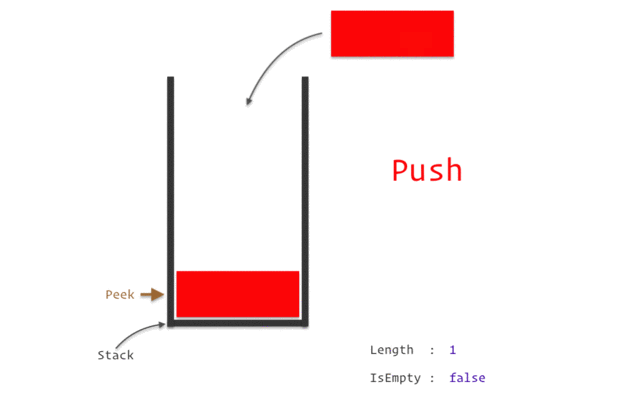

<h1>스택 </h1>

- 제한적으로 접근할 수 있는 나열
- 접근은 스택의 끝에서만 일어남
- 뒤에 넣고 뒤에 있는 것을 빼는 LIFO(Last In First Out)
- [명령어](https://www.notion.so/962e13d092f74a63aff103dc89911e88)
- 스택구조
        
    
        
    
    스택의 구조를 그림으로 나타낸 모습