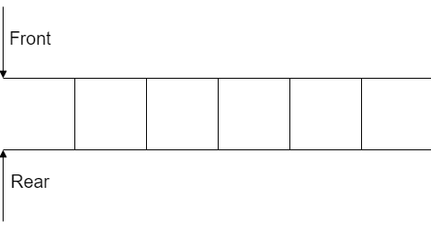
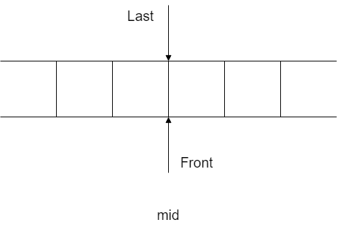
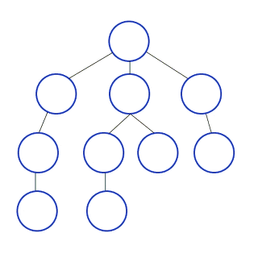

<h1>자료구조 & 알고리즘</h1>

- **빅오표기법**
    - 알고리즘의 효율도를 분석하는 방법
    - **기본적으로, 알고리즘 최악의 경우의 복잡도를 측정**
    - 표기: ex)O(n),O(log n),O(1)

- **스택**
    - 제한적으로 접근할 수 있는 나열
    - 접근은 스택의 끝에서만 일어남
    - 뒤에 넣고 뒤에 있는 것을 빼는 LIFO(Last In First Out)
    - [명령어](https://www.notion.so/962e13d092f74a63aff103dc89911e88)
    - 스택구조
        
        
        
    
    스택의 구조를 그림으로 나타낸 모습
    
    - 구현(c)
    
    ```c
    #include<stdio.h>
    #include<string.h>
    typedef  struct stack{
    	int top;
    	int data[10000];
    } stack_a;
    void stack_reset(stack_a *z) {
    	z->top = 0;
    }
    void push(stack_a* z,int c) {
    	z->data[(z->top)++] = c;
    }
    int pop(stack_a* z) {
      if(z->top==0)
        return -1;
      else  
    	  return z->data[--(z->top)];
    }
    int size(stack_a *z) {
    	return z->top;
    }
    int empty(stack_a *z) {
    	if (z->top == 0)
    		return 1;
    	else
    		return 0;
    }
    int top(stack_a *z) {
      if(z->top==0)
      return -1;
      else 
    	return z->data[z->top-1];
    }
    int main() {
    	int a,c;
    	char b[100010];
    	stack_a z;
    	stack_reset(&z);
    	scanf("%d",&a);
    	for (int i = 0; i < a;i++) {
    		scanf("%s", b);
    		if (strcmp(b,"push")==0) {
    			scanf("%d",&c);
          push(&z,c);
    		}
    		else if (strcmp(b,"pop")==0) {
    			printf("%d\n",pop(&z));
    		}
    		else if (strcmp(b,"size")==0) {
    			printf("%d\n",size(&z));
    		}
    		else if (strcmp(b,"empty")==0) {
    			printf("%d\n",empty(&z));
    		}
    		else if (strcmp(b,"top")==0) {
    			printf("%d\n",top(&z));
    		}
    	}
    	return 0;
    }
    funtion(&s[i]);
    ```
    

- **큐**
    - 스택과 유사하지만 FIFO(First In First Out)방식을 사용한다
    - 접근이 스택의 앞과 뒤에서 일어남
    - 큐 구조
    
    
    
    - [명령어](https://www.notion.so/941794de4b0248cfaeb68b08181d03a7)
    - 구현(c)
    
    ```c
    #include<stdio.h>
    #include<string.h>
    typedef struct queue{
      int front;
      int back;
      int arr[100000];
    }queue;
    int size(queue *que){
      return que->back-que->front;
    }
    int empty(queue *que){
      if(size(que)!=0)return 0;
      else return 1;
    }
    void push(queue *que,int n){
      que->arr[que->back++]=n;
    }
    void pop(queue *que){
      if(!empty(que))
        printf("%d\n",que->arr[que->front++]);
      else
        printf("-1\n");
    }
    void front(queue *que){
      if(!empty(que))
        printf("%d\n",que->arr[que->front]);
      else
        printf("-1\n");
    }
    void back(queue *que){
      if(!empty(que))
        printf("%d\n",que->arr[que->back-1]);
      else
        printf("-1\n");
    }
    int main(){
        queue que;
        int n;
        scanf("%d",&n);
        for(int i=0;i<n;i++){
          char order[6];
          scanf("%s",order);
          if(!strcmp(order,"push")){
            int n;
            scanf("%d",&n);
            push(&que,n);
          }
          else if(!strcmp(order,"pop"))
            pop(&que);
          else if(!strcmp(order,"size"))
            printf("%d\n",size(&que));
          else if(!strcmp(order,"empty"))
            printf("%d\n",empty(&que));
          else if(!strcmp(order,"front"))
            front(&que);
          else if(!strcmp(order,"back"))
            back(&que);
        }
    }
    ```
    

- **덱(dequeue)**
    - 스택과 큐를 합친 느낌의 자료구조
    - 앞과 뒤에서 접근이 일어날 수 있음
    - 검색하지 않을 때 사용하기 용이함
    - 데이터 접근을 앞 뒤에서 다 할 수 있어서 접근을 무작위로 하고 싶을 때 용이함
    - 구현을 연결 리스트로 할 수 있음
    - 데큐 구조
    
    
    
    - [명령어](https://www.notion.so/66d0c0f502a24f65b48b5ae8c4898e18)
    - 구현(c)
    
    ```cpp
    #include<iostream>
    #include<vector>
    using namespace std;
    vector<int>deq;
    void push_front(int a){
      deq.insert(deq.begin(),a);
    }
    void push_back(int a){
      deq.push_back(a);
    }
    void front(){
      printf("%d\n",deq.front());
    }
    void back(){
      printf("%d\n",deq.back());
    }
    void size(){
      printf("%ld\n",deq.size());
    }
    void empty(){
      int a=deq.empty()?1:0;
      printf("%d\n",a);
    }
    void pop_front(){
      printf("%d\n",deq.front());
      deq.erase(deq.begin());
    }
    void pop_back(){
      printf("%d\n",deq.back());
      deq.pop_back();
    }
    int main(){
      int n;
      scanf("%d",&n);
      for(int i=0;i<n;i++){
        string str;
        cin>>str;
        if(str=="push_front"){
          int a;
          scanf("%d",&a);
          push_front(a);
        }
        else if(str=="push_back"){
          int a;
          scanf("%d",&a);
          push_back(a);
        }
        else if(str=="front"){
          if (deq.size()!=0)
            front();
          else
            printf("-1\n");
        }
        else if(str=="back"){
          if (deq.size()!=0)
            back();
          else
            printf("-1\n");
        }
        else if(str=="pop_front"){
          if (deq.size()!=0)
            pop_front();
          else
            printf("-1\n");
        }
        else if(str=="pop_back"){
          if (deq.size()!=0)
            pop_back();
          else
            printf("-1\n");
        }
        else if(str=="empty"){
          empty();
        }
        else if(str=="size"){
          size();
        }
      }
    }
    ```
    

- **서치(알고리즘)**
    - [선형서치(Linear Search)](https://www.notion.so/596715d04a104c52a6193e258fc07908)
    - [이진서치(Binary Search)](https://www.notion.so/c8b7a6fc4bd24627969c4ad99f09d99c)

- **정렬(알고리즘)**
    - [선택정렬](https://www.notion.so/52423fe830844d14a1916226ebff84ab)
    - [삽입정렬](https://www.notion.so/0482368a4c1e419bbd1b68e49d7475a0)
    - [버블정렬](https://www.notion.so/02d6d4a3523c4c72b1b5aa18fa313840)
    - 퀵정렬
    - 합병정렬

- **그래프(Graph)**
    
    그래프는 vertex와 edge로 구성된 한정된 자료구조임
    
    ### 용어
    
    - 정점(vertex)
        
        노드(node)라고도 부르며 데이터가 저장되는 지점
        
    - 간선(edge)
        
        링크(arcs)라고도 부르며 정점들을 연결 시켜주는 역할
        
    
    ### 구현 방법
    
    - **인접 리스트**
        
        그래프의 노드들을 리스트로 표현한 것
        
        정점의 리스트 배열을 만들어 관계를 설정해서 구현한다'
        
        ### 장점
        
        - 정점들의 연결 정보를 탐색하는데 O[n]의 시간 복잡도를 가진다
        - 필요한 만큼의 공간만 사용하기 때문에 공간의 낭비가 적다
        
        ### 단점
        
        - 특정 두 점이 연결되었는지 확인하려면 인접 행렬 보다 시간이 오래 걸린다
        - 구현이 비교적 어렵다
    - **인접 행렬**
        
        그래프의 정점을 2차원 배열로 구현한 
        
        정점을 연결하는 정점에 대해서 인접 정점이라면 1을 아니라면 0을 삽입한다
        
        ### 장점
        
        - 2차원 배열에 모든 간선에 정보를 담아서 배열의 위치를 확인하면 두 점에 대한 정보를 조회할 때 O[1]의 시간 복잡도를 가진다.
        - 구현이 비교적 간단하다
        
          
        
        ### 단점
        
        - 모든 정점에 대해서 정보를 대입해야 해서 O[n^2]의 시간 복잡도를 가진다
        - 무조건 2차원 배열로 구현하므로 필요 이상의 공간이 필요하다
    
    ### 탐색 방법
    
    - **DFS**(깊이 우선 탐색)
        
        
        
        그래프를 갈 수 있는 만큼 깊이 가고
        
        더 이상 갈 수 없을 때 이전 정점으로 돌아가는 방식을 사용함
        
        주로 재귀 함수나 스택으로 구현함
        
    - **BFS**(넓이 우선 탐색)
        
        
        
        시작 정점을 방문하고 시작 정점에 인접한 모든 정점을 방문하는 방식
        
        일반적으로 큐로 구현함
        

- **트리(tree)**
    
    그래프의 일종으로, 여러 노드가 한 노드를 가리킬 수 없는 구조이다. 서로 다른 두 노드를 잇는 길이 하나뿐인 그래프를 트리라고 부른다.
    
    ### 용어
    
    - 노드(node)
        
        트리의 데이터가 저장되는 각 지점
        
    - 간선(edge)
        
        노드들을 연결하는 선
        
    
    ### 종류
    
    - 이진트리
        
        자식 노드가 2개밖에 없는 트리(모든 트리가 이진 트리는 아님)
        
        - 이진 탐색 트리
            
            모든 노드가 특정 순서를 따르는 속성이 있는 이진 트리
            
    
    ### 이진 트리 구현 방법
    
    ```cpp
    #include<iostream>
    using namespace std;
    class Tree {
    public:
        int data;
        Tree* left, * right;
    };
    int main() {
        int n;
        cin >> n;
        Tree tree[101];//n이 100보다 작다
        for (int i = 1; i <= n+1;i++) {
            tree[i].data = 0;
            tree[i].left = nullptr;
            tree[i].right = nullptr;
        }
        tree[1].data = 1;
        for (int i = 0; i < n; i++) {
            int x, y;//x 부모,y 자식
            cin >> x >> y;
            tree[y].data = y;
            tree[x].left == nullptr ? tree[x].left = &tree[y] : tree[x].right = &tree[y];
        }
    }
    ```
    
    ### 탐색
    
    - 전위 순회(PreOrder)
        
        현재 노드→왼쪽 노드→오른쪽 노드
        
        ```cpp
        #include<iostream>
        using namespace std;
        class Tree {
        public:
            int data;
            Tree* left, * right;
        };
        void preOrder(Tree* tree) {
            if (tree != NULL) {
                cout << tree->data << endl;
                preOrder(tree->left);
                preOrder(tree->right);
            }
        }
        int main() {
            int n;
            cin >> n;
            Tree tree[101];//n이 100보다 작다
            for (int i = 1; i <= n+1;i++) {
                tree[i].data = 0;
                tree[i].left = nullptr;
                tree[i].right = nullptr;
            }
            tree[1].data = 1;
            for (int i = 0; i < n; i++) {
                int x, y;//x 부모,y 자식
                cin >> x >> y;
                tree[y].data = y;
                tree[x].left == nullptr ? tree[x].left = &tree[y] : tree[x].right = &tree[y];
            }
            preOrder(&tree[1]);
        }
        ```
        
    - 중위 순회(InOrder)
        
        왼쪽 노드→현재 노드→오른쪽 노드
        
        ```cpp
        #include<iostream>
        using namespace std;
        class Tree {
        public:
            int data;
            Tree* left, * right;
        };
        void InOrder(Tree* tree) {
            if (tree != NULL) {
                InOrder(tree->left);
                cout << tree->data << endl;
                InOrder(tree->right);
            }
        }
        int main() {
            int n;
            cin >> n;
            Tree tree[101];//n이 100보다 작다
            for (int i = 1; i <= n+1;i++) {
                tree[i].data = 0;
                tree[i].left = nullptr;
                tree[i].right = nullptr;
            }
            tree[1].data = 1;
            for (int i = 0; i < n; i++) {
                int x, y;//x 부모,y 자식
                cin >> x >> y;
                tree[y].data = y;
                tree[x].left == nullptr ? tree[x].left = &tree[y] : tree[x].right = &tree[y];
            }
            InOrder(&tree[1]);
        }
        ```
        
    - 후위 순회(PostOrder)
        
        왼쪽 노드→오른쪽 노드→현재 노드
        
        ```cpp
        #include<iostream>
        using namespace std;
        class Tree {
        public:
            int data;
            Tree* left, * right;
        };
        void PostOrder(Tree* tree) {
            if (tree != NULL) {
                PostOrder(tree->left);
                PostOrder(tree->right);
        				cout << tree->data << endl;
            }
        }
        int main() {
            int n;
            cin >> n;
            Tree tree[101];//n이 100보다 작다
            for (int i = 1; i <= n+1;i++) {
                tree[i].data = 0;
                tree[i].left = nullptr;
                tree[i].right = nullptr;
            }
            tree[1].data = 1;
            for (int i = 0; i < n; i++) {
                int x, y;//x 부모,y 자식
                cin >> x >> y;
                tree[y].data = y;
                tree[x].left == nullptr ? tree[x].left = &tree[y] : tree[x].right = &tree[y];
            }
            PostOrder(&tree[1]);
        }
        ```
        

- **리스트(List)**
    - 각 노드가 데이터와 포인터를 가지고 있고 한 줄로 연결되어 있는 선형적 자료구조이다
    - 자료 추가와 삭제가 O(1)의 시간 복잡도를 가진다는 장점이 있다
    - 특정 데이터의 위치를 찾는데 O(n)의 시간 복잡도를 가진다는 단점도 있다
        
        ## 종류
        
        - 단일 연결 리스트
            
            노드에 자료 공간과 한 개의 포인터 공간이 있고, 각 노드의 포인터는 다음 노드를 가리키는 리스트
            
        - 이중 연결 리스트
            
            단일 연결 리스트와 비슷하지만, 포인터 공간이 두 개가 있고 각각의 포인터는 앞의 노드와 뒤의 노드를 가리키는 리스트
            

---

[스택 명령어](https://www.notion.so/962e13d092f74a63aff103dc89911e88)

[큐 명령어](https://www.notion.so/941794de4b0248cfaeb68b08181d03a7)

[선형서치](https://www.notion.so/596715d04a104c52a6193e258fc07908)

[이진서치](https://www.notion.so/c8b7a6fc4bd24627969c4ad99f09d99c)

[삽입정렬](https://www.notion.so/0482368a4c1e419bbd1b68e49d7475a0)

[덱 명령어](https://www.notion.so/66d0c0f502a24f65b48b5ae8c4898e18)

[버블정렬](https://www.notion.so/02d6d4a3523c4c72b1b5aa18fa313840)

[선택정렬](https://www.notion.so/52423fe830844d14a1916226ebff84ab)